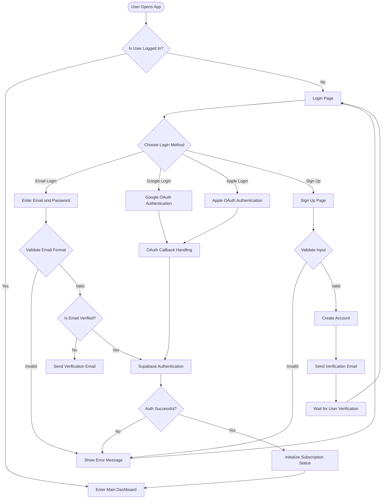
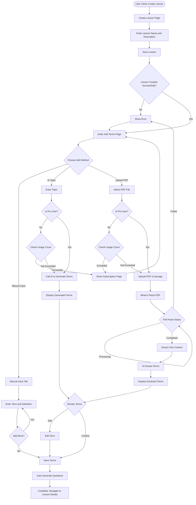
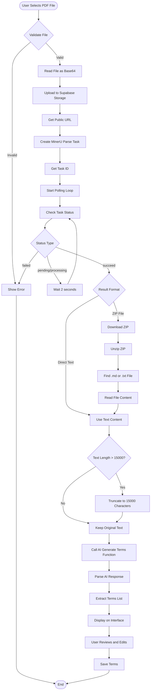
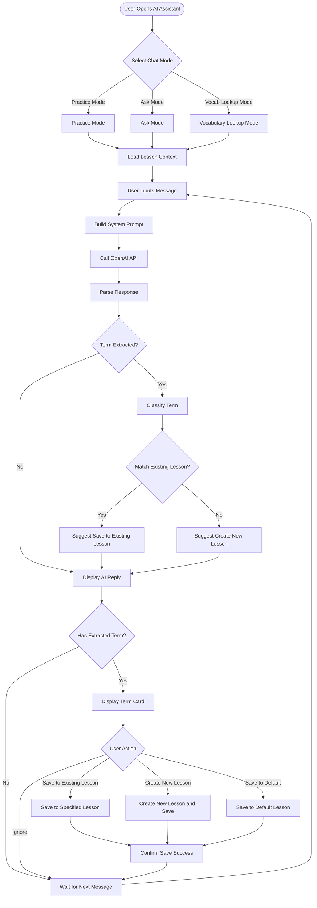
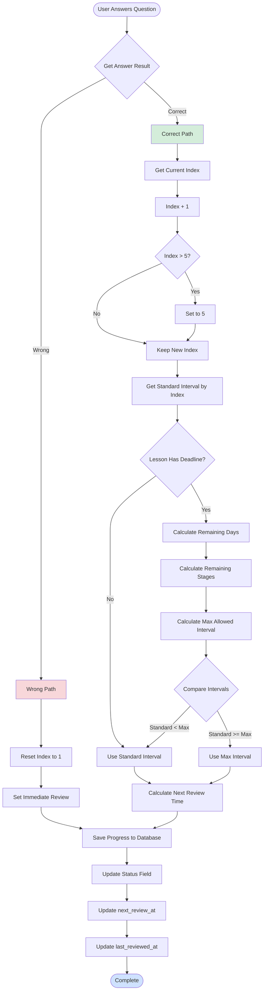
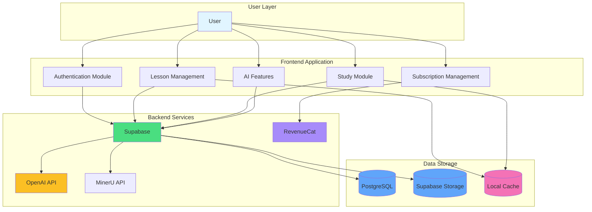

# MemQ Product Workflow Diagrams

This document uses Mermaid diagrams to illustrate the complete workflow of the MemQ product.

---

## 1. User Registration and Login Flow



---

## 2. Create Lesson and Add Terms Flow



---

## 3. Study Flow (SRS Spaced Repetition System)

```mermaid
flowchart TD
    Start([User Starts Study]) --> SelectMode{Select Study Mode}
    SelectMode -->|Today Mode| TodayMode[Get All Terms Due Today from All Lessons]
    SelectMode -->|Lesson Mode| LessonMode[Get All Terms from Specified Lesson]
    
    TodayMode --> FetchTerms[Fetch Terms List]
    LessonMode --> FetchTerms
    
    FetchTerms --> FetchProgress[Fetch User Study Progress]
    FetchProgress --> SRSFilter[SRS Algorithm Filter]
    
    SRSFilter --> CheckDue{Check Due Reviews}
    CheckDue -->|Has Due| AddDueReviews[Add to Due Reviews List]
    CheckDue -->|No Due| CheckNew{Check New Terms}
    
    CheckNew -->|Has New| AddNewItems[Add to New Items List]
    CheckNew -->|No New| AllCaughtUp[Show "All Caught Up" Page]
    
    AddDueReviews --> CombineLists[Combine Lists and Shuffle]
    AddNewItems --> CombineLists
    CombineLists --> LimitSize[Limit to 20 Questions]
    LimitSize --> LoadQuestions[Load Questions]
    
    LoadQuestions --> StudySession[Start Study Session]
    StudySession --> ShowQuestion[Display Question]
    ShowQuestion --> AnswerType{Question Type}
    
    AnswerType -->|Multiple Choice| MCQ[Display Options]
    AnswerType -->|True/False| TrueFalse[Display True/False]
    AnswerType -->|Fill in Blank| FillBlank[Display Input Field]
    
    MCQ --> SelectAnswer[User Selects Answer]
    TrueFalse --> SelectAnswer
    FillBlank --> InputAnswer[User Inputs Answer]
    InputAnswer --> SelectAnswer
    
    SelectAnswer --> CheckAnswer[Check Answer]
    CheckAnswer --> IsCorrect{Is Answer Correct?}
    
    IsCorrect -->|Yes| CorrectFeedback[Show Correct Feedback]
    IsCorrect -->|No| WrongFeedback[Show Wrong Feedback]
    
    CorrectFeedback --> UpdateProgress[Update Progress: Index + 1]
    WrongFeedback --> UpdateProgress2[Update Progress: Downgrade to Learning]
    
    UpdateProgress --> CalculateNextReview[Calculate Next Review Time]
    UpdateProgress2 --> SetImmediateReview[Set Immediate Review]
    
    CalculateNextReview --> SaveProgress[Save Progress to Database]
    SetImmediateReview --> SaveProgress
    
    SaveProgress --> AutoAdvance{Answered Correctly?}
    AutoAdvance -->|Yes| Wait1200ms[Wait 1.2 seconds]
    AutoAdvance -->|No| ShowContinue[Show Continue Button]
    
    Wait1200ms --> NextQuestion
    ShowContinue --> UserContinue[User Clicks Continue]
    UserContinue --> NextQuestion
    
    NextQuestion --> CheckMore{More Questions?}
    CheckMore -->|Yes| ShowQuestion
    CheckMore -->|No| ShowSummary[Show Study Summary]
    
    ShowSummary --> Finish[Return to Lesson List]
    AllCaughtUp --> ReviewAll{User Chooses Review All?}
    ReviewAll -->|Yes| ForceReview[Force Review All Questions]
    ReviewAll -->|No| Finish
    ForceReview --> LoadQuestions
```

---

## 4. PDF Processing Flow (Detailed)



---

## 5. AI Chat Assistant Flow



---

## 6. Subscription Purchase Flow

```mermaid
flowchart TD
    Start([User Triggers Subscription]) --> CheckAuth{Is User Logged In?}
    CheckAuth -->|No| ShowLogin[Prompt Login]
    CheckAuth -->|Yes| NavigatePaywall[Navigate to Unlock Page]
    
    ShowLogin --> LoginPage[Login Page]
    LoginPage --> NavigatePaywall
    
    NavigatePaywall --> ShowUnlockPage[Show Unlock Page]
    ShowUnlockPage --> ClickTrial[Click "Start Free Trial"]
    ClickTrial --> ShowPaywallModal[Show Paywall Modal]
    
    ShowPaywallModal --> LoadOfferings[Load RevenueCat Offerings]
    LoadOfferings --> DisplayPlans[Display Plan Options]
    
    DisplayPlans --> SelectPlan{Select Plan}
    SelectPlan -->|Yearly| YearlyPlan[Yearly Plan]
    SelectPlan -->|Monthly| MonthlyPlan[Monthly Plan]
    
    YearlyPlan --> ShowSavings[Display Savings Percentage]
    MonthlyPlan --> ShowSavings
    ShowSavings --> ClickSubscribe[Click "Try Free and Subscribe"]
    
    ClickSubscribe --> CheckAuth2{Verify Login Again}
    CheckAuth2 -->|No| ShowLogin
    CheckAuth2 -->|Yes| PurchasePackage[Call RevenueCat Purchase]
    
    PurchasePackage --> PurchaseResult{Purchase Result}
    PurchaseResult -->|Success| UpdateSubscription[Update Subscription Status]
    PurchaseResult -->|User Cancelled| SilentReturn[Silent Return]
    PurchaseResult -->|Failed| ShowError[Show Error Message]
    
    UpdateSubscription --> RefreshStatus[Refresh Subscription Status]
    RefreshStatus --> ShowSuccess[Show Success Message]
    ShowSuccess --> CloseModal[Close Paywall Modal]
    
    ShowError --> DisplayPlans
    SilentReturn --> DisplayPlans
    CloseModal --> Finish([Complete])
```

---

## 7. SRS Algorithm Detailed Flow (Update Study Progress)



---

## 8. Overall Application Architecture Flow



---

## Diagram Descriptions

### Flowchart Type Descriptions

1. **User Registration and Login Flow**: Shows how users register, login, and verify email
2. **Create Lesson and Add Terms Flow**: Shows lesson creation and three ways to add terms
3. **Study Flow (SRS)**: Shows the study flow based on spaced repetition system
4. **PDF Processing Flow**: Detailed flow of PDF upload, parsing, and term extraction
5. **AI Chat Assistant Flow**: Shows the workflow of three AI chat modes
6. **Subscription Purchase Flow**: Shows the complete flow from triggering subscription to completing purchase
7. **SRS Algorithm Detailed Flow**: Shows the algorithm logic for updating study progress
8. **Overall Application Architecture Flow**: Shows the relationships between system modules

### Color Legend

- **Green**: Success/Correct Path
- **Red**: Error/Failure Path
- **Blue**: Data Storage/Services
- **Yellow**: AI Services
- **Purple**: Third-party Services

---

*Last Updated: 2025-01-15*
